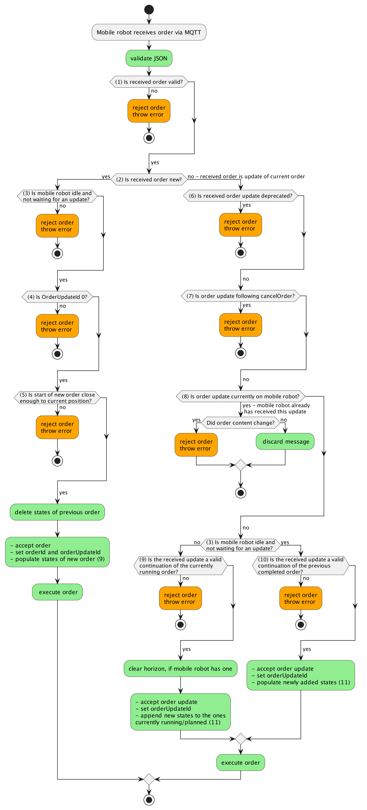

# 6. 订单协议

`order` 主题是移动机器人接收订单的 MQTT 主题，包含机器人移动或执行动作的指令。

## 6.1 概念与逻辑

运输订单的核心是一个定义路线的节点-边图段。移动机器人被期望遍历节点和边以完成订单。

所有连接节点和边的完整图由车队控制持有，其中可能包含限制条件（例如，允许哪些移动机器人遍历哪条边）。这些限制不会传达给移动机器人。车队控制仅在订单中包含相关移动机器人允许遍历的边。

> 
> **图 2**：车队控制中的图表示和订单中传输的图

节点和边作为两个列表在订单消息中传递。节点和边列表内的顺序也决定了它们被遍历的顺序。`sequenceId` 在节点和边之间共享，定义遍历顺序。第一个节点的 `sequenceId` 为 0，第一个边的 `sequenceId` 为 1，第二个节点的 `sequenceId` 为 2，依此类推。`sequenceId` 为 n 的边连接 `sequenceId` 为 n-1 和 n+1 的节点。`sequenceId` 在订单内应是连续的。

对于有效订单，至少有一个节点，边数应等于节点数减一。

订单的第一个节点 (`sequenceId` = 0) 对移动机器人来说应是trivial可达的，并且始终是已发布的。这意味着移动机器人已经站在该节点上，或者移动机器人在该节点的偏差范围内。因此，第一个节点不应在 `nodeStates` 中报告。

节点和边都具有布尔属性 `released`。如果节点或边已发布，机器人应遍历它。如果节点或边未发布，机器人不应遍历它。

边只有在它的起点和终点节点都已发布时才能被发布。

已发布边之后不能跟随未发布的节点或边。

已发布的节点和边的集合称为 **"基线"(Base)**。
未发布的节点和边的集合称为 **"视界"(Horizon)**。

可以发送没有视界的订单。

订单消息不一定描述完整的运输订单。为了交通控制和适应资源受限的移动机器人，完整的运输订单（可能包含许多节点和边）可以拆分为多个子订单，通过 `orderId` 和 `orderUpdateId` 连接。

## 6.2 订单与订单更新

为支持交通管理，车队控制可以将通过订单传达的路径分为两部分：

- **基线 (Base)**：移动机器人被允许行驶的已定义路线。基线的所有节点和边已由车队控制为该移动机器人发布。基线的最后一个节点称为**决策点**。
- **视界 (Horizon)**：车队控制为移动机器人规划的在决策点之后行驶的路线。该路线尚未由车队控制发布。

如果未向基线添加更多节点和边，移动机器人应在决策点停止。为确保流畅移动，如果交通情况允许，车队控制应在移动机器人到达决策点之前扩展基线。

由于 MQTT 是异步协议且无线网络传输不可靠，基线无法更改。车队控制因此应假设基线已被移动机器人执行。本规范后面部分描述了取消订单的程序，但由于上述通信限制，这也被认为是不可靠的。

车队控制可以通过向移动机器人发送包含更改的节点和边列表的更新路线来更改视界。更改视界路线的程序如图 3 所示。

> 
> **图 3**：扩展行驶路线"视界"的程序

图 3 中，初始订单首先由车队控制在 t = 0 时发送。

### 订单示例

**初始订单**：
```json
{
  "orderId": "1234",
  "orderUpdateId": 0,
  "nodes": [
    { "nodeId": "f", "released": true },
    { "nodeId": "d", "released": true },
    { "nodeId": "g", "released": true },
    { "nodeId": "b", "released": false },
    { "nodeId": "h", "released": false }
  ],
  "edges": [
    { "edgeId": "e1", "released": true },
    { "edgeId": "e3", "released": true },
    { "edgeId": "e8", "released": false },
    { "edgeId": "e9", "released": false }
  ]
}
```

**订单更新**（扩展视界）：
```json
{
  "orderId": "1234",
  "orderUpdateId": 1,
  "nodes": [
    { "nodeId": "g", "released": true },
    { "nodeId": "b", "released": true },
    { "nodeId": "h", "released": true },
    { "nodeId": "i", "released": false }
  ],
  "edges": [
    { "edgeId": "e8", "released": true },
    { "edgeId": "e9", "released": true },
    { "edgeId": "e10", "released": false }
  ]
}
```

注意 `orderUpdateId` 递增，并且订单更新的第一个节点对应于上一条订单消息的最后一个基线节点（拼接节点）。来自上一基线的其他节点和边不会重新发送。

这确保移动机器人也可以执行订单更新，即订单更新的第一个节点可以通过执行移动机器人已知的边到达。

### 订单接收流程

> 
> **图 4**：订单或订单更新的接收流程

1. **订单格式是否有效？**：检查 JSON 数据类型和格式是否正确
2. **是新订单还是订单更新？**：接收到的订单 `orderId` 与机器人当前持有的 `orderId` 是否不同
3. **机器人是否空闲且不等待更新？**：机器人是否处于空闲状态且没有等待的视界
4. **orderUpdateId 是否为 0？**：新订单的 `orderUpdateId` 是否为 0
5. **新订单起点是否在当前位置范围内？**：机器人是否已站在该节点上，或是否在节点的偏差范围内
6. **收到的订单更新是否已过时？**：收到的 `orderUpdateId` 是否小于或等于机器人当前的
7. **订单更新是否在 cancelOrder 之后？**：车队控制不应发送取消订单的任何进一步更新
8. **收到的更新是否与当前机器人上的订单相同？**：收到的 `orderUpdateId` 是否等于机器人当前的
9. **收到的更新是否是当前仍在运行的订单的有效延续？**：新基线的第一个节点是否等于上一个基线的最后一个节点
10. **收到的更新是否是已完成订单的有效延续？**：机器人不再执行任何动作且没有视界时，新基线的第一个节点是否等于上一个基线的最后一个节点

#### 6.1.2.1 订单完成

移动机器人遍历完订单的最后一个节点并完成所有相关动作后，进入空闲状态，准备接收新订单。

## 6.3 订单取消

车队控制可以使用即时动作 `cancelOrder` 取消活动订单。

车队控制可以选择性地传递 `orderId` 来指定要取消的订单。

收到 `cancelOrder` 即时动作后，移动机器人应尽快停止。对于循线导航移动机器人，这可能是下一个可行的节点。自由导航移动机器人应尽快停止，而不仅仅是在下一个节点。

如果 `actionStates` 中有安排的动作，这些动作应被取消，并在 `actionState` 中报告为 'FAILED'。
如果 `actionStates` 中有正在运行的动作，这些动作应被取消，也应报告为 'FAILED'。
如果动作无法取消，该动作的 `actionState` 应通过在运行时报告 'RUNNING' 来反映这一点，之后报告相应的状态（如果成功则 'FINISHED'，如果不成功则 'FAILED'）。
当 `actionStates` 中有正在运行的动作时，`cancelOrder` 动作应报告 'RUNNING'，直到所有动作都被取消/完成。无法取消的动作（`cancelAllowed = false`）应完成。

移动机器人的所有移动和 `actionStates` 中的所有动作停止后，`cancelOrder` 动作状态应报告 'FINISHED'。

移动机器人然后应处于空闲状态，准备接收新订单。

`orderId` 和 `orderUpdateId` 保持不变。

> 
> **图 5**：取消订单后的预期行为

### 取消后接收新订单

订单取消后，移动机器人处于空闲状态，准备接收新订单。车队控制不应再发送对该订单的任何订单更新。如果移动机器人收到订单更新，应报告类型为 'ORDER_UPDATE_FOLLOWING_CANCEL'、级别为 'WARNING' 的错误。

对于只能在一个节点上定位自身的移动机器人，新订单应从移动机器人当前站立的节点开始。

对于可以在节点之间停止的移动机器人，车队控制可以决定如何开始下一个订单。移动机器人应接受这两种方式：

1. 新订单的第一个节点是位于移动机器人当前位置的临时节点。移动机器人应识别该节点是 trivial 可达的，并接受订单。
2. 新订单的第一个节点是上一个订单的最后一个遍历节点。该节点的允许偏差设置得足够大，以确保移动机器人处于该范围内。因此，移动机器人应立即将该节点视为已遍历，并接受订单。

### 机器人在空闲状态下收到 cancelOrder

如果移动机器人收到 `cancelOrder` 即时动作，但移动机器人当前处于空闲状态，或者动作中指定的 `orderId` 与移动机器人当前活动订单的 `orderId` 不匹配，`cancelOrder` 动作应报告为 'FAILED'。

移动机器人应报告类型为 'NO_ORDER_TO_CANCEL'、级别为 'WARNING' 的错误。即时动作的 `actionId` 应作为 `errorReference` 传递。

## 6.4 订单拒绝

移动机器人在以下场景中应拒绝订单：

| 场景 | 响应 |
|------|------|
| 订单格式错误 | 报告 `VALIDATION_FAILURE` 错误，级别 WARNING |
| 订单包含不支持的参数 | 报告 `UNSUPPORTED_PARAMETER` 错误，级别 CRITICAL |
| 订单包含无法执行的动作 | 报告 `INVALID_ORDER_ACTION` 错误，级别 WARNING |
| 相同 orderId 但 orderUpdateId 更低 | 报告 `OUTDATED_ORDER_UPDATE` 错误，级别 WARNING |
| 相同 orderId 和相同 orderUpdateId | 忽略（内容相同）或报告 `SAME_ORDER_UPDATE_ID` 错误（内容不同） |
| 不同的 orderId 且有活动订单 | 报告 `OTHER_ORDER_ACTIVE` 错误，级别 WARNING |
| 起始节点超出范围 | 报告 `START_NODE_OUT_OF_RANGE` 错误，级别 WARNING |
| 至少有一个节点不可达 | 报告 `NO_ROUTE_TO_TARGET` 错误，级别 WARNING |
| 当前模式不允许接收订单 | 报告 `MOBILE_ROBOT_NOT_AVAILABLE` 错误，级别 WARNING |
| 订单包含未知 mapId | 报告 `UNKNOWN_MAP_ID` 错误，级别 WARNING |

### 拒绝处理规则

1. 移动机器人不应将新订单接收到其内部缓冲区
2. 移动机器人应保持之前的订单在其缓冲区中
3. 错误应持续报告，直到移动机器人接受新订单

## 6.5 走廊 (Corridors)

走廊是一种可选的边属性，允许移动机器人偏离边轨迹以避开障碍物，并定义移动机器人允许运行的范围边界。

使用走廊属性需要预定义的轨迹。如果未定义走廊属性，移动机器人将遵循该轨迹。定义了走廊属性的移动机器人行为仍然是循线导航移动机器人的行为，只是允许暂时偏离轨迹以避开障碍物。

> 
> **图 6**：带走廊属性的边

### 走廊参数

| 参数 | 类型 | 说明 |
|------|------|------|
| `leftBoundary` | array | 左边界的坐标点 |
| `rightBoundary` | array | 右边界的坐标点 |
| `releaseRequired` | boolean | 是否需要车队控制批准使用走廊 |

### 走廊越界处理

移动机器人的运动控制软件应持续检查移动机器人是否在定义的边界内。如果没有，移动机器人应停止并报告类型为 'OUTSIDE_OF_CORRIDOR'、级别为 CRITICAL 的错误。

车队控制可以决定是否需要用户交互，或者移动机器人是否可以通过取消当前订单并向移动机器人发送包含允许移动机器人再次移动的走廊信息的新订单来继续。

### 订单接收流程

> 
> **图 4**：订单或订单更新的接收流程

1. **订单格式是否有效？**：检查 JSON 数据类型和格式是否正确
2. **是新订单还是订单更新？**：接收到的订单 `orderId` 与机器人当前持有的 `orderId` 是否不同
3. **机器人是否空闲且不等待更新？**：机器人是否处于空闲状态且没有等待的视界
4. **orderUpdateId 是否为 0？**：新订单的 `orderUpdateId` 是否为 0
5. **新订单起点是否在当前位置范围内？**：机器人是否已站在该节点上，或是否在节点的偏差范围内
6. **收到的订单更新是否已过时？**：收到的 `orderUpdateId` 是否小于或等于机器人当前的
7. **订单更新是否在 cancelOrder 之后？**：车队控制不应发送取消订单的任何进一步更新
8. **收到的更新是否与当前机器人上的订单相同？**：收到的 `orderUpdateId` 是否等于机器人当前的
9. **收到的更新是否是当前仍在运行的订单的有效延续？**：新基线的第一个节点是否等于上一个基线的最后一个节点
10. **收到的更新是否是已完成订单的有效延续？**：机器人不再执行任何动作且没有视界时，新基线的第一个节点是否等于上一个基线的最后一个节点

## 6.3 订单取消

车队控制可以取消移动机器人当前正在执行的订单。取消可以通过发送新的空订单或通过特定取消消息实现。

## 6.4 订单拒绝

移动机器人可以拒绝接收订单。拒绝原因可能包括：
- 订单格式错误
- 无法到达订单中的节点
- 机器人当前状态不允许接收新订单

## 6.5 走廊 (Corridors)

走廊是一种可选的约束机制，允许车队控制为移动机器人定义更精确的行驶边界。机器人可以在状态消息中请求使用特定走廊。