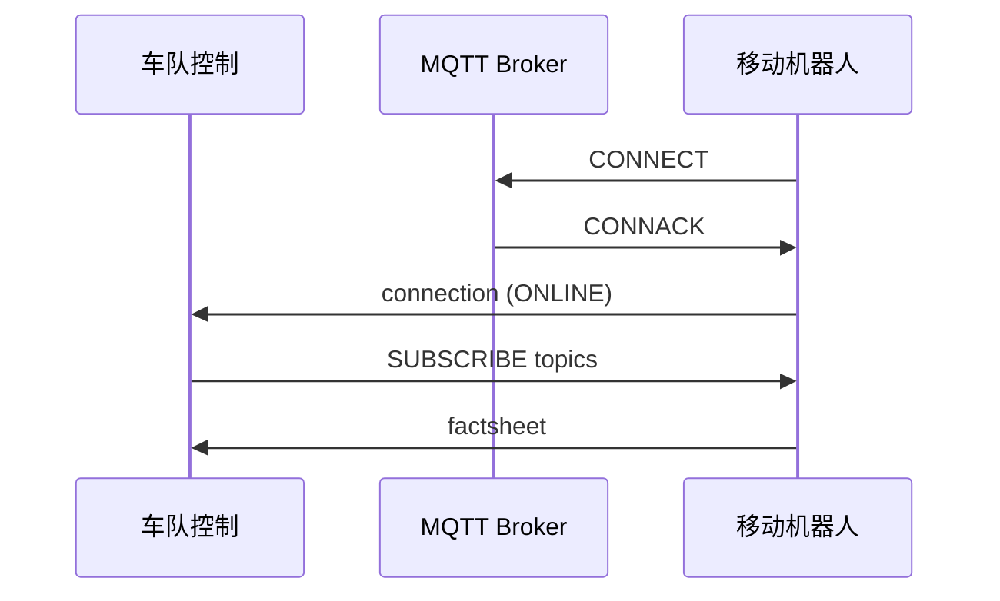
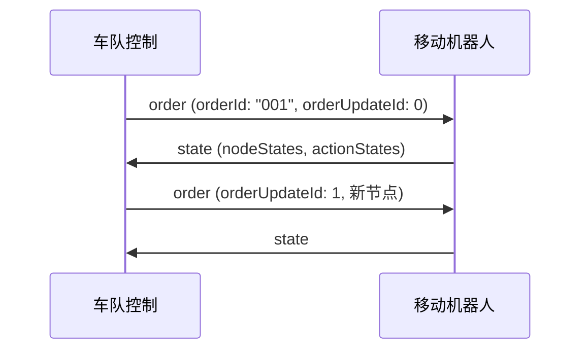
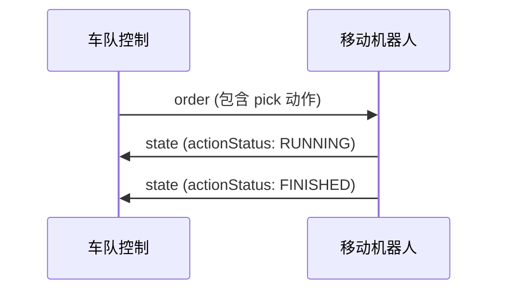

# VDA 5050 实现指南

本指南帮助开发者实现 VDA 5050 接口。

## 系统架构

> 

## 消息流程

### 1. 连接建立



### 2. 订单执行



### 3. 动作执行



## MQTT 主题结构

```
vda5050/v3/{manufacturer}/{serialNumber}/{topic}
```

### 示例

| 场景 | 主题 |
|------|------|
| 接收订单 | vda5050/v3/RobotCorp/AGV-001/order |
| 发送状态 | vda5050/v3/RobotCorp/AGV-001/state |
| 接收即时动作 | vda5050/v3/RobotCorp/AGV-001/instantActions |
| 发送连接状态 | vda5050/v3/RobotCorp/AGV-001/connection |

## 关键实现要点

### 1. 订单处理

- 验证订单 JSON 格式
- 检查 `orderId` 和 `orderUpdateId`
- 处理基线（Base）和视界（Horizon）
- 实现节点/边遍历逻辑

### 2. 状态管理

- 维护当前订单状态
- 跟踪节点和边状态
- 报告动作执行进度
- 处理错误和信息

### 3. 动作执行

- 实现阻塞类型逻辑
- 处理并行动作
- 管理动作状态转换
- 支持重试机制

### 4. 连接管理

- 实现 Last Will 消息
- 处理断开/重连
- 支持休眠模式

## 常见实现问题

### 问题 1：订单丢失

**症状**：机器人未收到订单

**解决方案**：
- 使用 QoS 1 确保交付
- 实现订单确认机制
- 定期检查订单状态

### 问题 2：状态消息丢失

**症状**：车队控制看不到机器人状态

**解决方案**：
- 状态消息使用 QoS 0（高频）
- 实现增量状态更新
- 添加心跳机制

### 问题 3：动作执行失败

**症状**：动作无法完成

**解决方案**：
- 使用 `RETRIABLE` 状态
- 实现 `retry` 和 `skipRetry` 动作
- 记录详细错误信息

## 测试工具

### MQTT 测试

```bash
# 订阅状态
mosquitto_sub -t "vda5050/v3/+/+/state"

# 发布订单
mosquitto_pub -t "vda5050/v3/RobotCorp/AGV-001/order" -f order.json
```

### JSON Schema 验证

使用官方提供的 JSON Schema 验证消息：
- `order.schema.json`
- `state.schema.json`
- `instantActions.schema.json`
- 等

## 参考实现

- [vda5050_msgs](https://github.com/ipa320/vda5050_msgs) - ROS 消息定义
- [coatyio/vda-5050-lib.js](https://github.com/coatyio/vda-5050-lib.js) - JavaScript 库
- [openTCS](https://github.com/OpenTCS/openTCS) - 开源车队控制系统